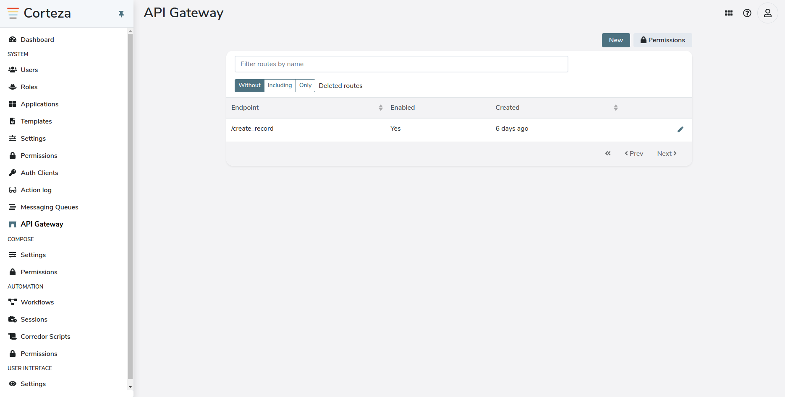
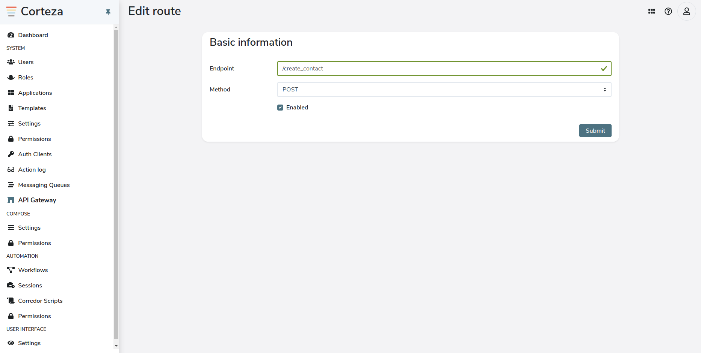
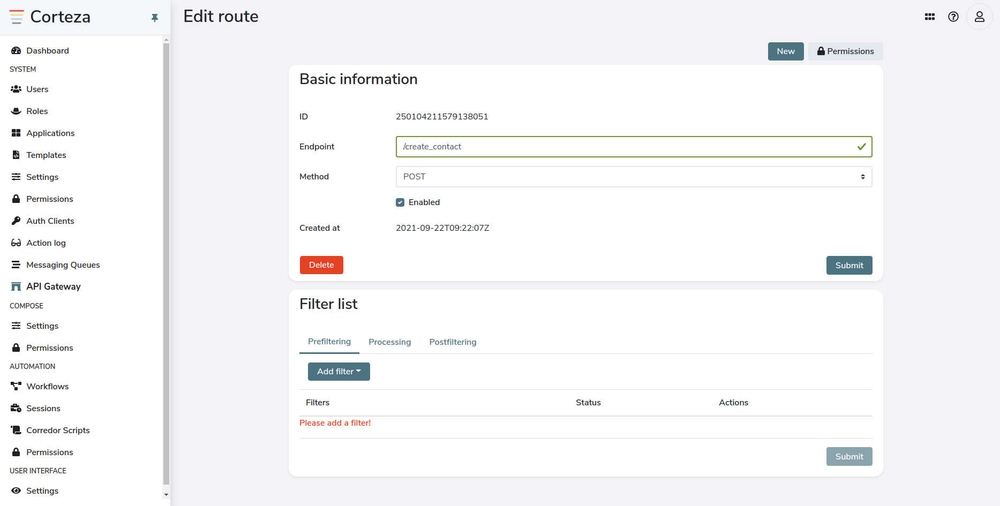
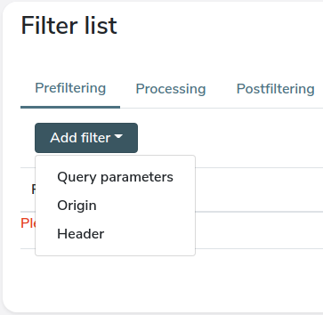
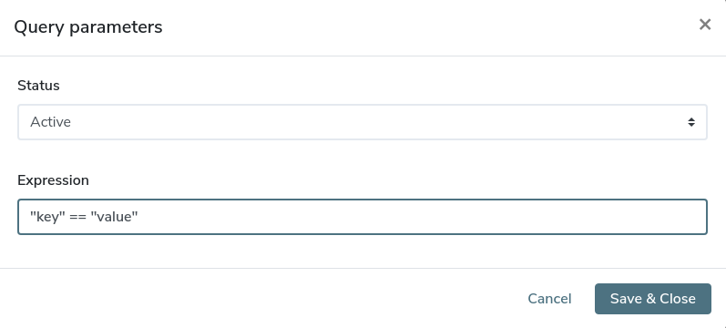
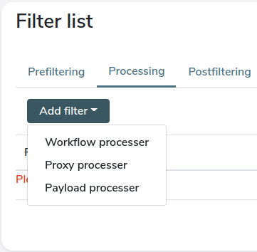
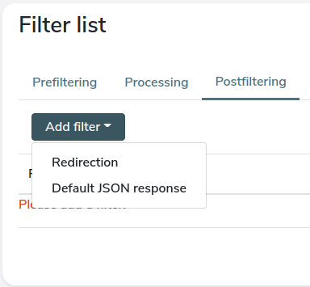

== DRAFT 1

//* what does it do; introduction
//* how do I access it
//* how do you use it
//* advanced topic

== DRAFT 2

//* what does it do; introduction
//** routing and processing gateway for HTTP requests
//
//* how do I access it
//** static content; corteza-server repo (https://github.com/cortezaproject/corteza-server)
//** resource translations; a button on each resource
//
//* how do you use it
//** static content
//*** add route along with filters which is in 3 steps as Prefilter, Processer and Postfilter
//*** Show all filters
//    - Prefilter
//        - Query parameter
//        - Origin
//        - Header
//    - Processing
//        - Payload processor
//        - Workflow processor
//        - Proxy processor
//    - Postfilter
//        - Redirection
//        - Default JSON response

== DRAFT 3

=== Introduction

Corteza’s API Gateway is a user-defined dynamic API system, enabling the routing and processing of arbitrary HTTP requests.
These defined interfaces allow users to interact with, or proxy, external web APIs allowing a wide range of coding functionality.
These developer-friendly requests can be validated, granularly limited, and extend additional functionality into the product with the introduction of Workflows.
Workflows are a rich debug stream to fix or set up our business processes.
If you wish to learn more about workflow, refer to menu:Integrator Guide[Corteza workflow].

=== how do I access them?
You can configure the routes from corteza web admin.

** corteza-server repo (https://github.com/cortezaproject/corteza-server)
** corteza-webapp-admin repo (https://github.com/cortezaproject/corteza-webapp-admin)

=== Configuring the gateway

Adding a new endpoint is as simple as configuring a new route with a designated endpoint URL and the HTTP method it handles.
Once the route is added and enabled, the endpoint is up and running, though open to the world as it has no authentication validation in check.

In order to configure routes user should have access to corteza web admin and valid permissions for APIGw.
After ensuring that we can go to the corteza web admin from the left sidebar, select the APIGw.

.APIGw routes:

=== Add route and filters to it

Fill the form with endpoint URL and HTTP method for it.
You can enable/disable it via enable checkbox.

Once you successfully add a route, you will be able to attach filters to it.

==== Let's walk you through how each filters works.
Filters are divided in 3 steps as Prefilter, Processer and Postfilter.

[NOTE]
====
- Status: Each filter has status which can be active or disabled, filter will apply based on it.
- Expression: this(statement) can be executed in JavaScript environment, See more info on xref:ROOT:integrator-guide/pages/expr/index.adoc[expressions].
- You can attach only one of each filter to every route
====

* Prefilters
** Once the request comes into the system, it can be validated, authenticated or capped via rate or other origin limit.
** The authentication layer will eventually be available as separate part from the Corteza authentication mechanism,
but there is currently ways to limit the API access via query parameters or headers.

*** Query parameters
- It is used to validate query parameter for the request.
- Once you select query parameter there will be a dialog with status(Active/Disabled) and expression.

*** Origin
- It is used to validate query parameter for the request.
- After selecting origin it will open same dialog as above screen, asking for status and expression.

*** Header
- It is used to validate header part of the request.
- It also opens the same dialog with status and expression.

* Processers
** The processers include most of the business logic for the request flow,
be it arbitrary payload data processing from request body or perusing the proxy processer with abilities
to use outbound authentication of choice and proxying the requests to the destination.

** A lot of our routes use the Corteza low-code workflows tool to process the requests
and make additional HTTP requests to external systems while having the ability to process the responses to our internal structures.

** The processing phase is to be able to process arbitrary data, use it in the low-code Corteza tools, log via server output, taking note of the performance.

** Not all requests can be done in real time, so there is also support for asynchronous routes.
The way the asynchronous routes work is to still be able to use the validation and authentication phases, the processing part is then
offloaded to the backend, so in effect, only the prefiltering and postfiltering is done synchronously.

** Since we have no way of knowing the output of the processing part, the last part — post filtering is done as a simple HTTP 202 request received response.

*** Workflow processor
- Adding this filter we can attach Corteza workflow to process the request
- To attach this filter we have to provide status(Active/Disabled) and workflowID of existing workflow in corteza.

*** Proxy processor
- @todo: not sure how to describe it; Input for this: status and location

*** Payload processor
- This is filter allows user to process payload with the help of JavaScript function,
which is one of the input along with status to attach this filter.

** Postfilters
*** The postfilters is to finalize the request life cycle depending on the processed data with the output format of the response that is defined in the post-filters.

*** Redirection
- For this we have to provide status, HTTP status and location after request is processed then based on response status,
it returns the given location if Http status matches.

==== Debugging
When connecting different API’s or receiving web-hooks, we are mostly aware of incoming data structures.

Even when we have a good API documentation and consistent data structures, we still need a useful debugging tool or at least logging facilities.

Currently, debugging level can be enabled via standard xref:ROOT:devops-guide/pages/configuration/server.adoc[Corteza environment configuration], so any input requests and body data can be logged to the underlying data aggregator or at least docker output.

There is basic performance analysis based on route and filter levels so any bottlenecks can be quickly spotted.
