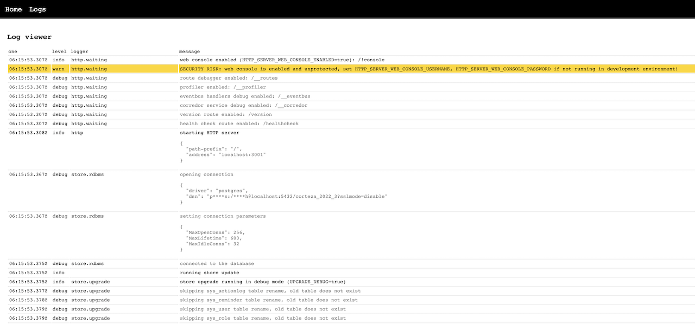

include::ROOT:partial$variables.adoc[]

= {PRODUCT_NAME} Server Web Console

In order to allow fast access to important server details, {PRODUCT_NAME} server offers Web Console interface.

When enabled console is accessible on at `/!console`

.Web console with server logs

Access control to the console is not provided through the usual RBAC subsystem but through basic HTTP auth mechanism and can be controled with `HTTP_SERVER_WEB_CONSOLE_USERNAME` and `HTTP_SERVER_WEB_CONSOLE_PASSWORD` variables.

Console is enabled and open to everyone by default in development environment (`ENVIRONMENT=dev`) or can be explicitly enabled by setting `HTTP_SERVER_WEB_CONSOLE_ENABLED` environmental variable to `true`. Default values for username is "admin" and random characters for password to avoid potential security issues.

[CAUTION]
====
Console exposes details and configuration about your physical or virtual server and {PRODUCT_NAME} itself. Make sure you always run it with username and password set
====
