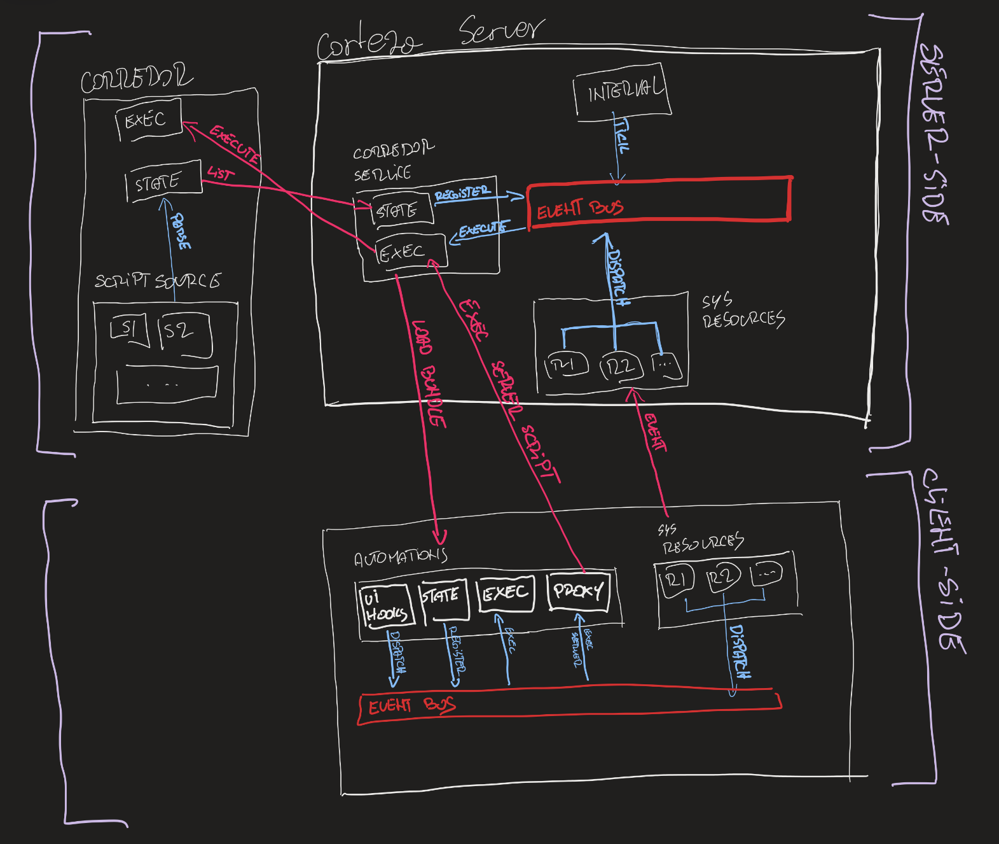

include::../variables.adoc[]

= Automation System Overview

== Automation system diagram

[NOTE]
====
This will probably become a UML diagram; this one is for development (faster updates).
@todo add some annotations and explanations on the diagram.
====

.Abstract representation of the automation system.

== Automation system components

=== {APP_AUTOMATION} server

.When {APP_AUTOMATION} server starts, it
. scans all search paths from configuration (`.env`) and load all scripts,
. scans all `package.json` files in all search paths, and install additional packages,
. runs file-change watchers for automation script reloading,
. runs file-change watchers for `package.json` files for dependency reloading.

=== {PRODUCT_NAME} server

.When {PRODUCT_NAME} server starts, it
. connects to {APP_AUTOMATION} server and loads all server and client scripts,
. creates event handlers from server script triggers and registers them in the event bus,
. configures the scheduler system to trigger both `onTimestamp` and `onInterval` events once per minute at the minute.

.When scheduling system on {PRODUCT_NAME} server ticks (once per minute), it
. dispatches event through the event bus,
. checks for registered events with compatible constraints,
. requests {APP_AUTOMATION} server to execute the relevant scripts.

.When user indirectly runs automation script via some action on the *server* (implicitly triggered *server* scripts)
. raises a specific event (`onSomething`, `beforeSomethingElse`, `afterSomethingElse`) and dispatches it through the event bus,
. checks for registered events with compatible constraints,
. requests {APP_AUTOMATION} server to execute the relevant scripts.

.When request is sent to `/sink` endpoint
. raises a `onRequest` event and dispatches it through the event bus,
. checks for registered events with compatible constraints,
. requests {APP_AUTOMATION} server to execute the relevant scripts.

=== {PRODUCT_NAME} web application

.When {PRODUCT_NAME} web application loads in a browser, it
. fetches appropriate automation scripts from the {PRODUCT_NAME} server in the form of a bundle,
. registers client scripts from the bundle in the event bus and the ui hooks.

.When user clicks on an automation button (explicitly triggered *client* script), it
. raises an event from the given configuration and the invocation context (related resource, user, custom arguments, ...),
. checks for registered events with compatible constraints,
. requests the script's execution inside the browser context (client-side execution).

.When user clicks on an automation button (explicitly triggered *server* script), it
. raises an event from the given configuration and the invocation context (related resource, user, custom arguments, ...),
. checks for registered events with compatible constraints,
. requests {APP_AUTOMATION} server to execute the relevant scripts via the {PRODUCT_NAME} server.

.When user indirectly runs automation script via some action in the *client* app (implicitly triggered *client* scripts), it
. raises a specific event (`onSomething`, `beforeSomethingElse`, `afterSomethingElse`) and dispatches it through the event bus,
. checks for registered events with compatible constraints,
. requests the script's execution inside the browser context (client-side execution).
