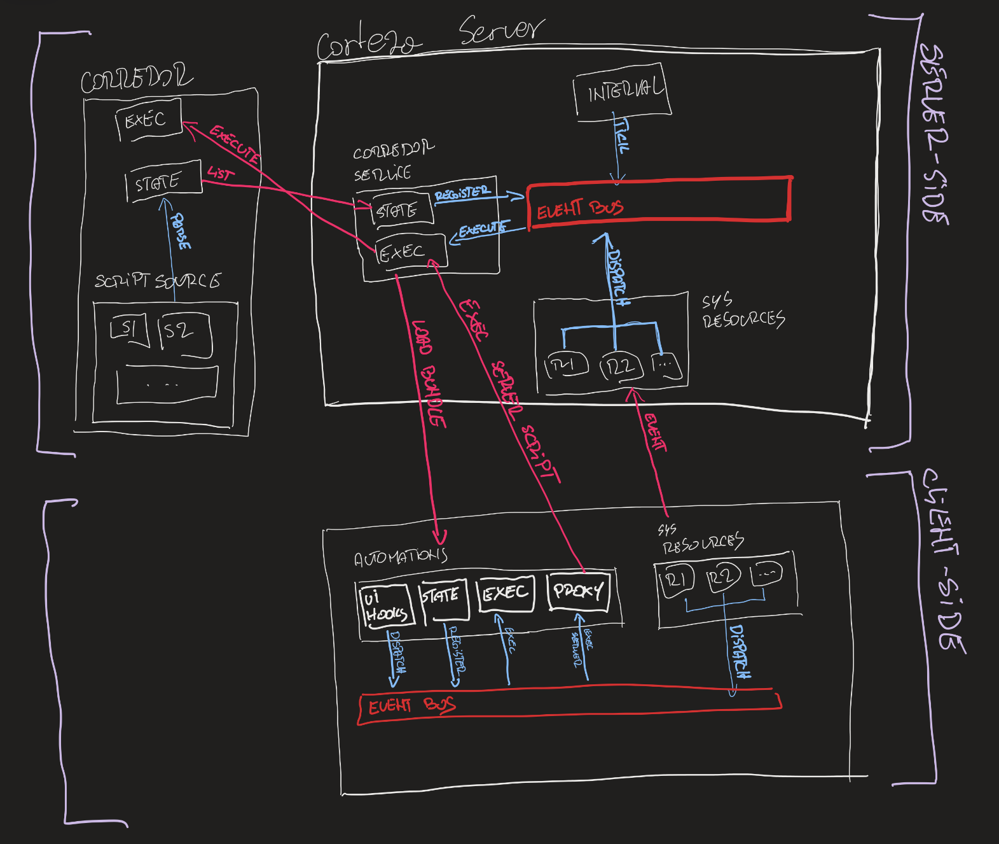

include::../variables.adoc[]

= Automation

{PRODUCT_NAME} provides a core with a minimal subset of features required for functionality, reliability and security of the system.
Automation allows us to build upon the core functionalities and develop new use case specific features, such as implementing business logic, custom user interface, task automation and much more.

[IMPORTANT]
====
As with any system, automation scripts can cause unwanted complications if misused or left open for modification by users who might do harm, willingly or otherwise.
See security (@todo) for details
====

== What can automations do

With the help of automation scripts we are able to:

Automate common/repetitive tasks::
    Automate repetitive, time consuming tasks and focus on the important bits.
    Such tasks can be calculating values, sending emails, generating documents and much more,

Implement business logic::
    Implement business logic specific to your use case.
    This can be as simple as sending emails to your clients or implementing a full blown CRM system,

Data processing::
    Run complex statistic operations on your data to uncover how you should tackle your market,

Data validation::
    Validate user input to assure data validity and thus assuring a robust system.

[NOTE]
====
There is a lot more that we can achieve with the automation system.
For additional examples and ideas refer to example section (@todo link) or get in touch with us.
====

== What automations can not do

@todo...

== Example use cases

Some of the more common use cases for the automation system include:

* sending a welcome email to a newly registered user,
* inserting calculated price fields,
* validating user input,
* implementing external integrations such as DocVerify, D&B Hoovers, ...

== Automation system diagram

[NOTE]
====
This will probably become a UML diagram; this one is for development (faster updates).
@todo add some annotations and explanations on the diagram.
====

.Abstract representation of the automation system.

