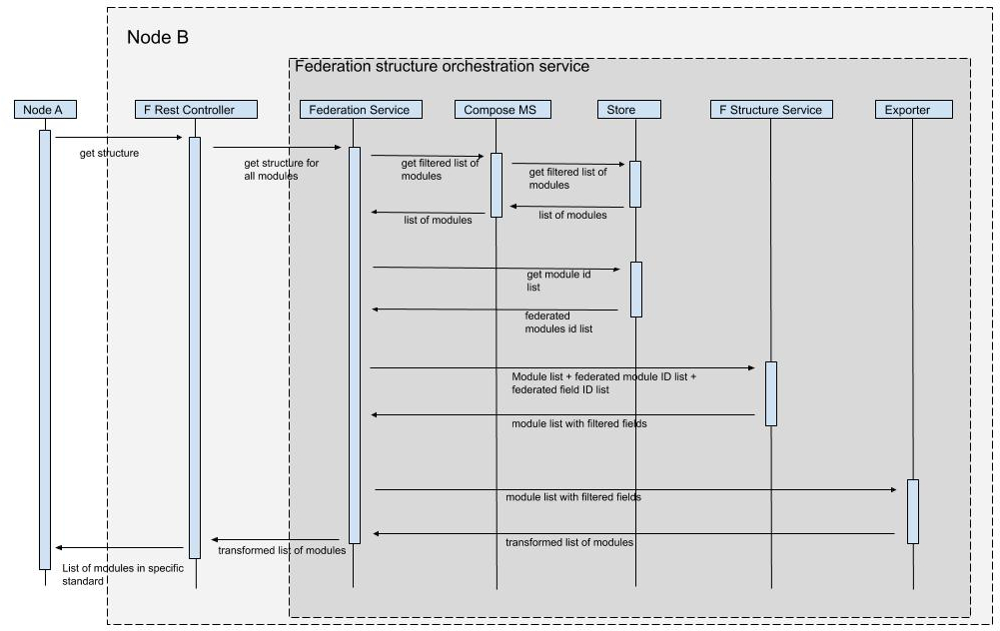

= Structure sync

Structure sync starts when both of the nodes are already paired and ready to receive data.

.Flow:
1. Starting with no information regarding the federated modules on node A, node B makes a request for the structure list
2. Node A serves the list of federated module endpoints
3. Node B parses the endpoints and starts to sync the structure data per-module by calling each of the endpoints in the master list
4. Node A serves the module details by fetching the federation info from store, module info via compose (from store) and filters the list to the end structure of choice (for now - json compose.Record)
5. Once the node B fetches the list, it stores the information to the federation store
6. Once the structure sync is done, the federation sync status is written to the store, along with the date of the action (needed by the data sync)

== Endpoints
|===
|Endpoint |Description
|/federation/nodes|Information on federation nodes
|/federation/structure |Master list of module changes
|/federation/structure/module/{id}|Federated module with federated fields
|/federation/data |Master sync endpoint
|/federation/data/module/{id}/records |Record list of a federated module
|===

