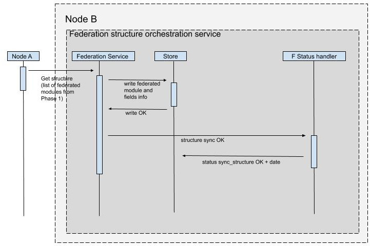

= Structure sync

== Structure sync part I - serve upstream modules on source node

Structure sync starts when both of the nodes are already paired and ready to receive data.

.Flow:
1. Starting with no information regarding the federated modules on node A, node B makes a request for the structure list
2. Node A serves the list of federated module endpoints
3. Node B parses the endpoints and starts to sync the structure data per-module by calling each of the endpoints in the master list
4. Node A serves the module details by fetching the federation info from store, module info via compose (from store) and filters the list to the end structure of choice (for now - json compose.Record)
5. Once the node B fetches the list, it stores the information to the federation store
6. Once the structure sync is done, the federation sync status is written to the store, along with the date of the action (needed by the data sync)

image:../images/federation_structure_sync.jpg[Diagram of the structure sync action as seen from node A]

== Structure sync part II - fetch modules on destination node (from source node)

.Flow:
1. Destination node (node B) sends a request to node A for the structural changes (/federation/structure)
2. Node A goes through the first phase (structure sync part 1) and serves the list of structures for all modules
3. Node B receives the list of endpoints and for each of the upstreamed modules (from node A), requests the specific endpoint for the federated module (/federation/structure/module/{id})
4. Node B parses the response from node A and writes the module and field data to the store
5. Note - only the module and field basic info is stored at this point - no compose.Module is created yet!
6. Once the module/field meta is saved to the federation store, the structure sync operation is marked as done for the node A/node B duo
7. Once the structure sync operation is done, the structure mapping on node A or data sync (even if no structure is mapped) can be commenced

== Endpoints
|===
|Endpoint |Description
|/federation/nodes|Information on federation nodes
|/federation/structure |Master list of module changes
|/federation/structure/module/{id}|Federated module with federated fields
|/federation/data |Master sync endpoint
|/federation/data/module/{id}/records |Record list of a federated module
|===

== DB

=== federation_module

|===
|Column |Desc
|id|
|rel_node|node id (can be also the same server if applying for upstream)
|rel_module_source|module id on source node
|rel_module_dest|mapped module on destination
|type|upstream/downstream
|===

=== federation_module_field

|===
|Column |Desc
|id|
|rel_module|federated module id
|rel_module_field_source|field id on source node
|rel_module_field_dest|mapped field on destination
|===

== Examples

*Module _Account_*

|===
|Example|id|rel_node|module_id_orig|field_id_orig|module_id_dest|field_id_dest|type

|Account module on node A (upstream)|000002|node_B_DISTINCT_ID|69199955985694737|69199955985694738|||upstream
|Account module on node B (downstream) - not yet mapped|0000001|node_A_DISTINCT_ID|69199955985694737|69199955985694738|||downstream
|Account module on node B (downstream) - mapped|0000003|node_A_DISTINCT_ID|69199955985694737|69199955985694738|69199955985694737|69199955985694739|downstream
|===

=== Phase 1 - node A

*federation_module*
|===
|id|rel_node|rel_module_source|rel_module_dest|type

|000001|node_A_DISTINCT_ID|module_node_A_id||upstream
|===

*federation_module_field*
|===
|id|rel_node|rel_module|rel_module_field_source|rel_module_field_dest

|000011|node_A_DISTINCT_ID|000001|000111||
|===

=== Phase 2 - node B

There are 2 phases in the 2. phase. First the module info from node A is saved. After that we can do the mapping. It is only during the mapping that the modules are created.

==== 1. Fetch and save the module info

*federation_module*
|===
|id|rel_node|rel_module_source|rel_module_dest|type

|000002|node_A_DISTINCT_ID|000001||downstream
|===

*federation_module_field*
|===
|id|rel_node|rel_module|rel_module_field_source|rel_module_field_dest

|000022|node_A_DISTINCT_ID|000001|000011(id)||
|===

==== 2. Mapping finished, modules created

Non-federated module was created after the module mapping in the administration.
Module id: module_node_B_id
Field id: module_field_node_B_id

*federation_module*
|===
|id|rel_node|rel_module_source|rel_module_dest|type

|000002|node_A_DISTINCT_ID|000001|module_node_B_id|downstream
|===

*federation_module_field*
|===
|id|rel_node|rel_module|rel_module_field_source|rel_module_field_dest|rel_module_field

|000022|node_A_DISTINCT_ID|000001|000011(id)|module_node_B_id|module_field_node_B_id|
|===

