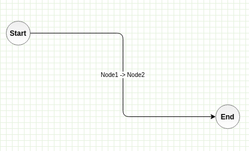

include::../../variables.adoc[]

= {PRODUCT_NAME} Workflows

Users can program custom logic by building {PRODUCT_NAME} Workflows.
Workflows are series of nodes connected by paths.

Workflows can be started through event triggers already supported in the core (before/after events, manual, scheduled)
and can run in parallel with {APP_AUTOMATION} automation scripts.

== Glossary

Configuration::
    A specific set of node with paths between them that control how workflow is executed.
    Configuration can be serialized and stored.

Expressions::
    Expressions aid with value assignment, conversion and condition testing.
    We us it to set, unset, modify values, send arguments to tasks and collect the results.
    See https://github.com/PaesslerAG/gval[PaesslerAG/gval] for syntax details.

Node::
    Task or gateway

Scope::
    Set of valid variables and their values

Task::
    Task is a node that can access and modify values in the scope.
    Task can call one configured function and can pass one or more argument to it and collect return values.

Gateway::
    Decision node that can control flow, fork or merge paths and create loops
    Gateway conditions are written with expressions that are

Function::
    Preconfigured logic that can execute one or more internal and/or external change or call.
    Functions accept arguments and return results.

Event::
    Events are triggered manually, delayed/scheduled, internally or externally

== Business Process Model and Notation 2 standard

Workflow internals, configuration and overall behavior will stay as close as possible to BPMN 2 specifications

== Configuration

Workflow nodes and paths serialized in JSON format.
This format supports all required workflow information, task configuration and expressions.

As an extension, it supports parameters needed for graphical representation of the workflow
(coordinates, dimensions, colors, images, ...)

=== Example

This workflow is represented by the config below

[source,json]
----
{
  "workflow": [
    {
      ...workflow-node1-configuration,
      "ext": {
        "graphics": {
          "id": "1",
          "xywh": [100, 100, 40, 40],
          "parent": "0",
          "value": "Start",
          "type": "ellipse",
          "edges": [
            {
              "id": "3",
              "value": "Node1 -> Node2",
              "parent": "0",
              "source": "1",
              "target": "2"
            },
          ],
        }
      } 
    },

    {
      ...workflow-node2-configuration,
      "ext": {
        "graphics": {
          "id": "2",
          "xywh": [400, 200, 40, 40],
          "parent": "0",
          "value": "End",
          "type": "ellipse",
          "edges": [
            {
              "id": "3",
              "value": "Node1 -> Node2",
              "parent": "0",
              "source": "1",
              "target": "2"
            },
          ],
        }
      } 
    }
  ]
}

----

=== Persistence

Workflow configurations are stored in {PRODUCT_NAME} store as separate resources.

=== Authoring YAML configuration files

Workflows can be configured via human-friendly YAML format.

[source,yaml]
----
# initial values
set:
  favNamespace: foo
  bzbz: 342

# start events
events:
  - type: beforeCreate
    resource: compose/record
    constraint:
      module.handle: aModule
    next: check price # proceed to one of the defined steps

security:
  runAs: foo

steps:
  "load module":
    (exec): moduleLookupByHandle
    (args):
      handle: foo
    bzz: foo + bar

  "sign the doc":
    (exec): docusignFoo
    (args):
      apiKey: dfsfdsfs
    header.title: fffff
    signature.name: Denis Arh

  "set record values":
    (exec): changeRecordValues
    (args):
      field: expr
      field[1]: expr

  "set record":
    (exec): changeRecord
    (args):
      ownerID: currentUser.ID
    (ref):
    (next):
----

#TBD How will extensions survive exporting to YAML?#

=== Authoring via GUI tool

{PRODUCT_NAME} will provide a visual tool for creating workflows.
Users will be able to create nodes and connections between them.
{PRODUCT_NAME} API will provide list of registered functions with parameters and return values.
This list will be used to dynamically create task configuration interfaces.

=== Provisioning

{product_name} will be able to use provided workflow configurations (from YAML files) to provision new deployments.

== References to internal resources

#TBD#

== Executing workflow

Workflow is executed in the same runtime as {PRODUCT_NAME} server. This makes workflows more performant and effective
in comparison to {APP_AUTOMATION} scripts but less flexible.

=== Start events

Workflows can be triggered by any core {PRODUCT_NAME} events.

=== Sessions

With each workflow execution a new session is created.
Each execution session is tracked (see <<_diagnostics_and_performance>>).

In case of intermediate events workflow sessions can be interacted by non-invokers.

.Example of use
- workflow is paused on intermediate "timer" event and will continue at scheduled time or after configured delay
- workflow is paused on intermediate "trigger" event and will continue when a certain event is triggered:
.. object is updated and fits specified constraints (module, field values)
.. email message from a specified sender is received
.. HTTP request is made to a specified endpoint

=== Session persistence

Workflow execution sessions can be stored to sustain system restarts #TBD#.

== Tasks

=== Assigner

Task without selected function is assigner.
It can execute ordered list of expressions that change scope's variables.

=== Functions

All functions must be registered with unique identifier (name), set of parameters (if any) and arguments (if any).
Built-in list of functions allow to perform all mayor tasks that are needed to support certain business logic.
These (built-in) functions are as primitive and atomic as possible.

.List of built-in functions can be extended via #TBD#:
. go's plugin capabilities,
. by defining new function that calls pre-defined function with sub set of arguments and can manipulate return values

.Examples:
- record lookup by id
- search for records
- update record
- create record
- modify record value
- convert record
- load module
- renderer (creating HTML, PDF documents)
- send mail
- parse email
- resize image
- send HTTP request
- ...

=== Parameters

Each function definition must provide definitions of all parameters it accepts (if any).

.Structure of parameter definition
[cols="1,2,3"]
|===
|name
|string
|Name of the parameter, expecting string that starts with a letter and can continue with any number of letters, numbers or underscores

|type
|string
|
`string`, `uint64`, `int64`, `float64`, `bool`, `map`, `slice`, `[]byte`
`ComposeRecord`, `ComposeModule`, `ComposeModuleField`, `ComposePage`, `ComposeChart`
`User`, `Role`

#TBD#

|description
|string
|

|required
|bool
|Is parameter required or not
|===

=== Arguments

Arguments must be compatible with defined function parameters otherwise workflow execution fails.

=== Results

.Structure of result definition
[cols="1,2,3"]
|===
|name
|string
|Name of the result, expecting string that starts with a letter and can continue with any number of letters, numbers or underscores

|type
|string
|
`string`, `uint64`, `int64`, `float64`, `bool`, `map`, `slice`,
`ComposeRecord`, `ComposeModule`, `ComposeModuleField`, `ComposePage`, `ComposeChart`
`User`, `Role`

|description
|string
|

|===

== Security

Workflow tasks follow same security constraints and checks as any other action that happens inside {product_name}.
When a particular workflow is triggered explicitly or implicitly, all tasks are executed in security context of the
user triggering the workflow. This can be overridden by explicitly defining run-as user.

=== Executing workflow as a different user

Workflows are separated in two groups when it comes to "run-as-user" requirements:

. If security descriptor can be taken from the current context (authenticated user) then that user is used.
. When security descriptor cannot be determined (scheduled, externally triggered) then run-as user must be provided.

Run-as user can also be collected from the scope of certain workflow triggering events.

.Example
If event is triggered by received email, run-as user can be dynamically set from the email's sender header.

=== Access control

.Workflow related operations on `system` resource:
[cols="1,2,3"]
|===
|workflow.create
|denied
|Role can see workflow and read workflow details

|===

.Operations on `system:workflow:*` resources:
[cols="1,2,3"]
|===
|read
|denied
|Role can see workflow and read workflow details

|update
|denied
|Role can update a workflow

|delete
|denied
|Role can remove a workflow

|execute
|denied
|Role can execute a workflow. This only applies to explicitly (manually) triggered workflows.
Implicit workflows are executed without this check.

|===

NOTE: Workflows are `system` resources but can be used to work with `compose` resources.

== Diagnostics and performance

Each workflow can be configured to run in `debug-mode` where it collects and logs step advancement, start-event input values, call stack, scope changes and logs from functions
All collected data is recorded with session ID.

=== Instrumentation

Each workflow execution is measured as a whole and in detail by counting and measuring execution time of each task.
